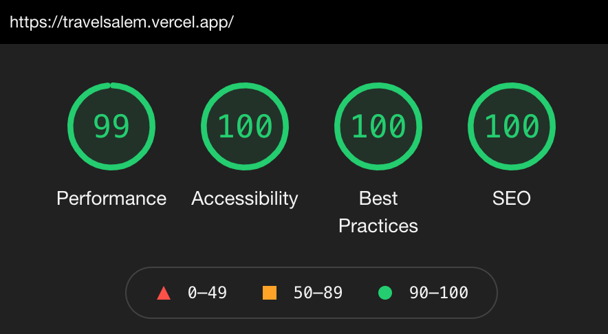

<!-- intro -->

A recent job posting led me to [travelsalem.com](https://travelsalem.com). The
website design is arguably dated and navigation proved to be cumbersome using
the complex menu system. Then I ran into
[bugs](https://github.com/dtjv/travelsalem.com/tree/main/screenshots).

It didn't take long to realize the site needed a modern design. As a personal
challenge, I built a one-page demo to address the issues I experienced and
perhaps sparks ideas about how best to improve the website's utility. This
article explains my design decisions.

<!-- intro -->

- View the [demo](https://travelsalem.vercel.app).
- View the [source code](https://github.com/dtjv/travel-salem).

**Update 9/31/2021**

Travel Salem has recently updated their website since I wrote this article. It
is much improved. Unfortunately, I didn't screen shot the old design to provide
better context for this article.

## Goals

To begin, I ran the website through Google Lighthouse to get a baseline of how
the site measured up. The scores were pretty low and in particular, the
performance was around 8%. Is Google Lighthouse the definitive test? Perhaps
not, but [travelsalem.com](https://travelsalem.com) is a content heavy website,
not a realtime, dynamic web app. I believe it should perform much better.

From the project outset, my goal was to achieve perfect Google Lighthouse scores
with a simple, modern user interface. I chose to build the demo using
[Next.js](https://nextjs.org), primarily for static site generation and image
optimization. And I used [Tailwind CSS](https://tailwindcss.com) to style the
website.

## Menus

The current site's navigation consists of two drop-down menus and a traditional
flat menubar. One of the drop-down menus is often repeated in expanded form at
the top of visited pages - giving the user up to four navigation options. The
other drop-down menu is three levels deep and at times renders off page with no
way to access the hidden menu items.

From a usability perspective, navigating multi-level drop-downs risks irritating
users when their cursor slips off the menu system, sending them back to square
one. I feel the whole point of content based websites is to present the content,
not hide it away in a menu. My design eliminates all drop-down menus.

## Content

To increase the site's utility is to provide easy access to pertinent content
with the fewest clicks. My design moves all the high level menu categories onto
the page and presents this information in a more visually appealing and engaging
manner.

For local businesses looking for exposure via travelsalem.com, my design
displays all business information directly on the main page, categorized by
industry. There's no need to search or drill down a menu system to locate a
plumber or florist.

## Sitemap

I added a proper footer that provides a simple and clear directory to site
content and Travel Salem's company information. The directory proved simple
enough to include it as the only menu choice for mobile devices - and it
vertically scrolls.

## Final Thought

This project was fun and offered challenges I'd not experienced before - such as
horizontal scrolling, tabbed based UI components and image optimization
techniques beyond what [Next.js](https://nextjs.org) offered.

One of the biggests time-sinks was dealing with image optimization. Google
Lighthouse often reported incorrect image sizing errors, or inaccessible overlay
text, or a too high image request count. Now, I think I found the right balance
of images, SVGs and plain text.

And what of the Google Lighthouse scores? All green. Not too bad. 😎

